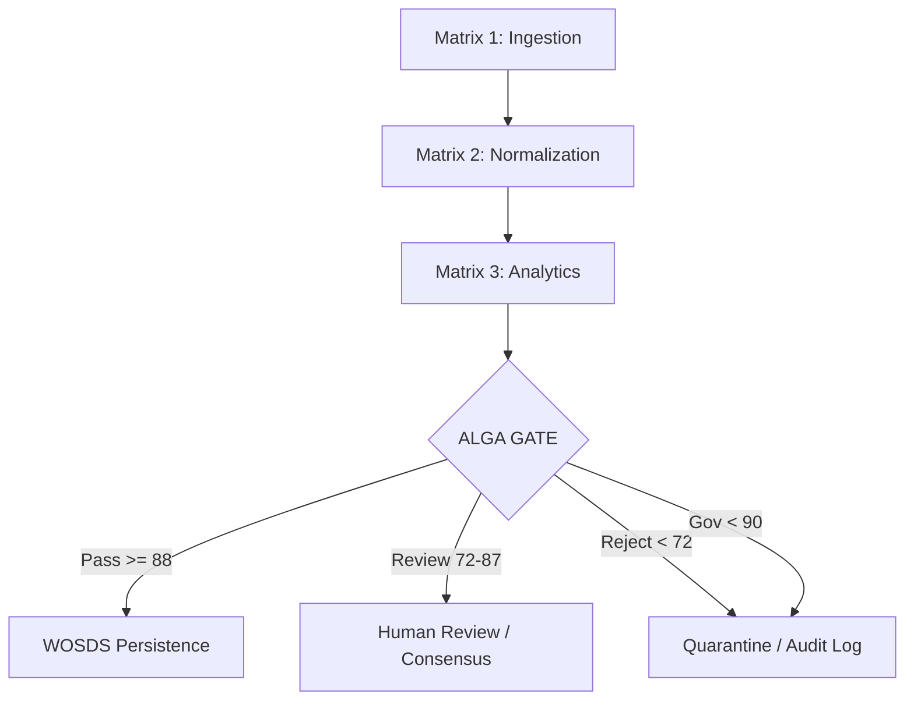

# ALGA + INNM-WOSDS Integration Decision 
**Operational Governance Specification for OX Intelligence**

## 1. Governance Architecture Positioning
ALGA is the mandatory **Runtime Truth & Governance Engine** for the ZQ_COORDINATOR platform. 

### Cross-Cutting Mandatory Gate
All artifacts generated by **Matrix 3 (Analytical Decisioning)** must pass the ALGA Gate before:
1. Persistence to **WOSDS (Write Once Secure Data Store)**.
2. Routing to **Matrix 4 (Feedback/Adaptive Learning)**.
3. Visibility within **OX Intelligence Dashboards**.

## 2. Integrated Processing Flow

## 3. Decision Thresholds & Operational Handlers

| Status | Composite | Governance | System Action |
|--------|-----------|------------|---------------|
| **PASS** | ≥ 88 | ≥ 90 | Auto-persistence to WOSDS. |
| **REVIEW** | 72–87 | ≥ 90 | Multi-agent consensus trigger + HITL. |
| **QUARANTINED**| Any | < 90 | Security block. Air-gapped isolation. |
| **REJECT** | < 72 | Any | Immediate discard + High-severity alert. |

## 4. Evidence Persistence (WOSDS)
Every ALGA run stores a `ClaimMap` including:
- **Accuracy Verifiers**: CoVe (Chain of Verification) logs.
- **Logic Trees**: Contradiction graph hashes.
- **Policy Flags**: KeyBox interaction audit.
- **Alignment Metrics**: User intent delta.

## 5. Deployment Variants
- **Server/Desktop (PRO)**: Full ensemble validation (150+ workers).
- **Mobile (Edge)**: Lite-mode validation (Accuracy + Governance focus).

---
*Authorized by ALGA Governance SPV - 2026*
